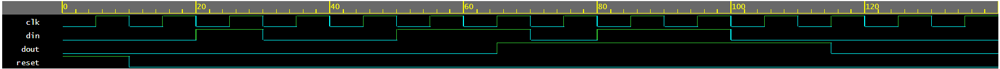

# 🧹 Pulse Filter / Debounce FSM — Verilog


It is a 4-state **Mealy FSM with a registered output** that removes short glitch pulses from a sampled data stream — a classic hardware **debounce** problem.

---

## 📋 Problem Statement

Design a digital circuit to eliminate short-duration ("glitch") pulses from a sampled data stream:

- A single `0` sample surrounded by `1`s must be corrected to `1`.
- A single `1` sample surrounded by `0`s must be corrected to `0`.
- The output only changes when the **same** input value is observed for **two consecutive samples** — a lone opposite-value sample is treated as noise and ignored.

### 🔎 Example

```
Input  : 0 1 0 0 1 1 0 1 1 0 0
Output : 0 0 0 0 0 1 1 1 1 1 0
```

---

## 🧠 Approach

This is modeled as a **4-state Mealy FSM** with a **synchronously registered output**, so the final `dout` is glitch-free — appropriate for a circuit whose entire job is signal cleanup.

### States

| State | Meaning |
|:-----:|---------|
| `s0`  | Confirmed output = **0** |
| `s0w` | In `s0`, just saw a single `1` — waiting to confirm |
| `s1`  | Confirmed output = **1** |
| `s1w` | In `s1`, just saw a single `0` — waiting to confirm |

### State Transition Table

| Current State | `din = 0` | `din = 1` |
|:---:|:---:|:---:|
| `s0`  | → `s0`  (out=0) | → `s0w` (out=0) |
| `s0w` | → `s0`  (out=0) | → `s1`  (out=1) |
| `s1`  | → `s1w` (out=1) | → `s1`  (out=1) |
| `s1w` | → `s0`  (out=0) | → `s1`  (out=1) |

The output only flips (`s0w → s1` or `s1w → s0`) when the **same** new value is seen **twice in a row**. A lone opposite sample sends the FSM back to its confirmed state without touching the output — that's the "debounce" behavior.

### 🧩 RTL Structure — 3 always blocks

1. **Next-state logic** *(combinational)* — `ps`, `din` → `ns`
2. **Mealy output logic** *(combinational)* — `ps`, `din` → `temp`
3. **Sequential block** *(`posedge clk` / `posedge reset`)* — `ps <= ns`, `dout <= temp`; reset forces `ps = s0`, `dout = 0`

---

## 📁 Files

| File | Description |
|------|--------------|
| `debouncer.sv` | RTL design |
| `debouncer_tb.sv` | Testbench |

---

## ✅ Verification

Simulated on [EDA Playground](https://www.edaplayground.com/) using **Aldec Riviera-PRO**.

The testbench drives the exact example sequence `0 1 0 0 1 1 0 1 1 0 0` into `din`, one sample per clock cycle. Since `dout` is a registered output, it lags the combinational (Mealy) result by exactly one clock cycle — the waveform below confirms the output correctly rejects isolated glitches and only flips once a value repeats for two consecutive samples.

### 🖥️ Simulation Waveform



- Lone `1`s and `0`s in `din` are correctly filtered out — no change in `dout`.
- `dout` rises only after two consecutive `1`s are seen, and falls only after two consecutive `0`s.
- Output transitions are clean, single-edge, and delayed by one clock cycle (registered output), with no glitches.

---

## 🛠️ Tools Used

- Aldec Riviera-PRO (via EDA Playground)
- EPWave for waveform inspection

---

## 👤 Author

**Dev Gothi** — B.Tech Electronics & VLSI Engineering, SVNIT Surat
[GitHub](https://github.com/dev-gothi)
