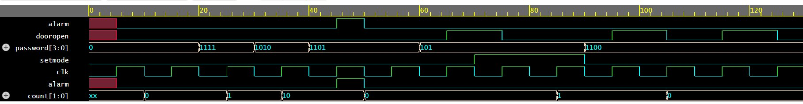

# Digital Door Lock System (4-Bit)

It is a Verilog implementation of a digital door lock system using a Finite State Machine (FSM). The system supports password verification, runtime password update, attempt-based alarm triggering, and setmode-based password change.

---

## Features

- 4-bit password matching
- 4-state FSM: IDLE, UNLOCKED, ERROR, ALARM
- Alarm triggers after 3 incorrect attempts
- Alarm persists until manual reset
- Runtime password update via `setmode` signal (only accessible after unlocking)
- Attempt counter resets only on successful unlock

---

## Module Interface

```verilog
module digitaldoorlock(
    input        clk,
    input        reset,
    input        setmode,
    input  [3:0] password,
    input  [3:0] newpassword,
    output reg   alarm,
    output reg   dooropen
);
```

### Port Description

| Port | Direction | Width | Description |
|---|---|---|---|
| clk | input | 1 | Clock signal |
| reset | input | 1 | Active high reset (only works from ALARM state) |
| setmode | input | 1 | Enables password update (only from UNLOCKED) |
| password | input | 4 | Password entered by user |
| newpassword | input | 4 | New password to store (used with setmode) |
| alarm | output | 1 | High when 3 wrong attempts made |
| dooropen | output | 1 | High when correct password entered |

---

## FSM Design

### States

| State | Description |
|---|---|
| IDLE | Waiting for password input |
| UNLOCKED | Correct password entered, door open |
| ERROR | Wrong password entered (attempt < 3) |
| ALARM | 3 wrong attempts, alarm active |

### State Transitions

```
IDLE ──correct password──────────→ UNLOCKED
IDLE ──wrong, count < 3──────────→ ERROR (count++)
IDLE ──wrong, count == 3─────────→ ALARM

ERROR ──correct password─────────→ UNLOCKED
ERROR ──wrong, count < 3─────────→ ERROR (count++)
ERROR ──wrong, count == 3────────→ ALARM

UNLOCKED ──setmode = 1───────────→ IDLE (password updated, count = 0)
UNLOCKED ──setmode = 0───────────→ IDLE (count = 0)

ALARM ──reset────────────────────→ IDLE
```

### Output Table

| State | dooropen | alarm |
|---|---|---|
| IDLE | 0 | 0 |
| ERROR | 0 | 0 |
| UNLOCKED | 1 | 0 |
| ALARM | 0 | 1 |

---

## Counter Logic

| Event | count |
|---|---|
| Wrong password | count++ |
| Correct password (UNLOCKED) | count = 0 |
| setmode password change | count = 0 |
| Reset button | No change |

> Reset does **not** clear the attempt counter — prevents bypassing the alarm by pressing reset repeatedly.

---

## Default Password

```verilog
temppassword <= 4'b0101;  // set on reset
```

---

## Simulation Waveform



### Waveform Walkthrough

| Time | password | count | State | Output |
|---|---|---|---|---|
| ~20ns | reset applied | 0 | IDLE | — |
| ~30ns | 1111 (wrong) | 1 | ERROR | dooropen=0 |
| ~40ns | 1010 (wrong) | 2 | ERROR | dooropen=0 |
| ~50ns | 1101 (wrong) | 3 | ALARM | alarm=1 |
| ~60ns | reset applied | 0 | IDLE | alarm=0 |
| ~70ns | 0101 (correct) | — | UNLOCKED | dooropen=1 |
| ~90ns | setmode + 1100 | 0 | IDLE | password updated |
| ~110ns | 1100 (new pass) | — | UNLOCKED | dooropen=1 |

---

## Tools Used

- EDA Playground (Aldec Riviera-PRO)
- EPWave for waveform viewing

---


