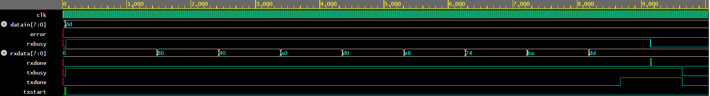

# UART (Universal Asynchronous Receiver/Transmitter) — Verilog Implementation

I had made the parameterizable, from-scratch UART transmitter and receiver written in Verilog, using a shared 16x-oversampled baud rate generator, FSM-based control logic, and shift-register-based serialization/deserialization.


---

## Overview

This project implements a complete UART core capable of full-duplex asynchronous serial communication, without relying on any vendor-specific IP. It was built to reinforce core RTL design concepts — clock domain timing, finite state machines, edge detection, and serial-to-parallel/parallel-to-serial conversion — that are foundational to digital design and VLSI work.

The design is split into four modules:

| Module | Description |
|---|---|
| `baudrategenerator` | Generates a 16x-oversampled tick from the system clock, based on configurable clock frequency and baud rate |
| `tx` | Transmitter FSM — serializes an 8-bit parallel input onto a single serial line |
| `rx` | Receiver FSM — deserializes an incoming serial line back into an 8-bit parallel output |
| `uarttop` | Top-level wrapper connecting `tx` and `rx` internally via a shared serial line (useful for loopback testing) |

---

## Architecture

### 1. Baud Rate Generator

Each of `tx` and `rx` instantiates its own copy of `baudrategenerator`, which produces a `tick` pulse 16 times per bit period:

```
maxcount = clkfreq / (baudrate * 16)
```

This 16x oversampling is standard UART practice — it allows the receiver to sample each incoming bit near its temporal center rather than at its edges, where the signal is most likely to have settled and least likely to be corrupted by transition noise or jitter.

### 2. Transmitter (`tx`)

**FSM states:** `IDLE → START → DATA → STOP → IDLE`

- The 16x `tick` is downsampled to a 1x-per-bit `txtick` using a 4-bit counter.
- On `IDLE` with `txstart` asserted, the input byte (`datain`) is parallel-loaded into an internal shift register (`temp`), and the FSM moves to `START`.
- In `DATA`, on every `txtick`, the current LSB (`temp[0]`) is driven onto `serialout`, and `temp` is right-shifted by one bit — transmitting LSB-first.
- A 3-bit `bitcount` tracks progress through the 8 data bits; once complete, the FSM moves to `STOP`, holds the line high for one bit period (UART idle/stop convention), and asserts `txdone`.
- `txbusy` is high throughout `START`, `DATA`, and `STOP`.

### 3. Receiver (`rx`)

**FSM states:** `IDLE → START → DATA → STOP → IDLE`

- **Start detection:** A one-cycle-delayed copy of the input line (`rxinprev`) is compared against the current line (`rxin`) to detect a falling edge (`rxinprev && !rxin`), which signals the start of a frame (UART lines idle high).
- **Mid-bit sampling:** Two nested counters manage timing:
  - `bitcounter` — counts 16x ticks within the *current* bit period, used purely to identify the sampling instant (`rxsample`).
  - `databits` — counts which of the 8 data bits is currently being received, incrementing once per full bit period.
- `rxsample` pulses for one cycle at the reliable mid-bit point: tick 7 in `START` (confirming a genuine start bit, not noise) and tick 15 in `DATA`/`STOP`.
- On each `rxsample` in `DATA`, the sampled bit is shifted into `rxdata` (`{rxin, rxdata[7:1]}`), reconstructing the byte LSB-first.
- In `STOP`, `rxsample` checks the stop bit: if the line isn't high, `error` is asserted (framing error).
- `rxdone` pulses for one clock cycle once the stop bit has been sampled, signaling that `rxdata` holds a valid, complete byte.

### 4. Top-Level (`uarttop`)

Wires `tx`'s `serialout` directly to `rx`'s `rxin` (`serialline`), forming an internal loopback — convenient for verifying the design without external hardware.

---

## Port Description

### `uarttop`

| Port | Direction | Width | Description |
|---|---|---|---|
| `clk` | input | 1 | System clock |
| `reset` | input | 1 | Synchronous, active-high reset |
| `txstart` | input | 1 | Pulse to begin transmission of `datain` |
| `datain` | input | 8 | Byte to transmit |
| `txbusy` | output | 1 | High while transmission is in progress |
| `txdone` | output | 1 | High during the stop bit of transmission |
| `rxbusy` | output | 1 | High while a frame is being received |
| `rxdone` | output | 1 | One-cycle pulse when a valid byte has been received |
| `error` | output | 1 | Asserted on stop-bit / framing error |
| `rxdata` | output | 8 | Received byte |

---

## Configuration

Baud rate and clock frequency are set via parameters in `baudrategenerator`:

```verilog
parameter clkfreq  = 8000;  // system clock frequency, Hz
parameter baudrate = 100;   // desired baud rate
```

`maxcount` and the counter width `n` are derived automatically from these.

---

## Simulation / Verification

To verify the design (e.g., in a testbench or on EDA Playground):

1. Instantiate `uarttop`.
2. Apply `reset`, then release it.
3. Drive `txstart` high for one cycle along with a test byte on `datain`.
4. Observe `rxdone` assert and `rxdata` match the transmitted byte after one full frame period.
5. To test error handling, inject a corrupted stop bit on the internal serial line and confirm `error` asserts.

### Sample Waveform



The waveform above shows a loopback simulation: `datain` (`dd`) is transmitted via `txstart`, shifted out serially, and progressively reconstructed by the receiver in `rxdata` before `rxdone` and `txdone` both assert, confirming a successful round trip with `error` held low throughout.

---

## Author

Dev Gothi — B.Tech Electronics and VLSI Engineering, SVNIT Surat
